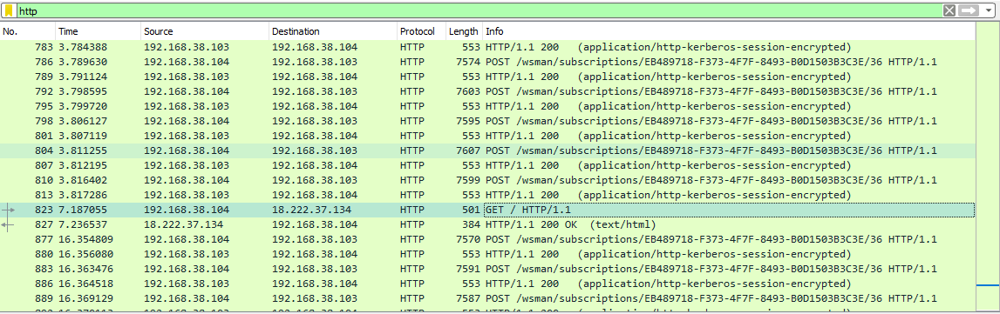
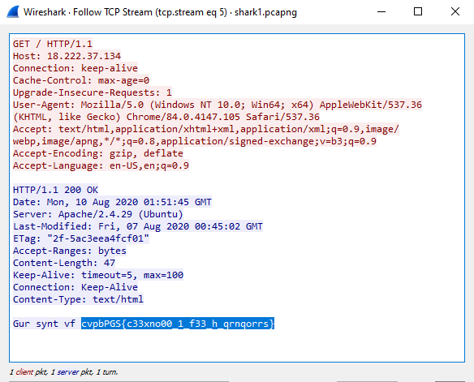

# Wireshark doo dooo do doo...

Category: Forensics

Author: Dylan

# Solution

We open `shark1.pcapng` on Wireshark and we apply `http` filter. We then find the packet of the *GET* request as shown below.

Then, we follow the TCP stream and we find the following message.

 This message is encrypted with ROT13 and we easily decrypt it to find the flag *picoCTF{p33kab00_1_s33_u_deadbeef}*.
